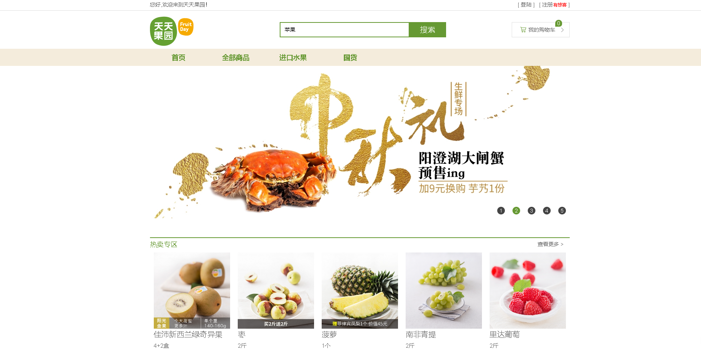
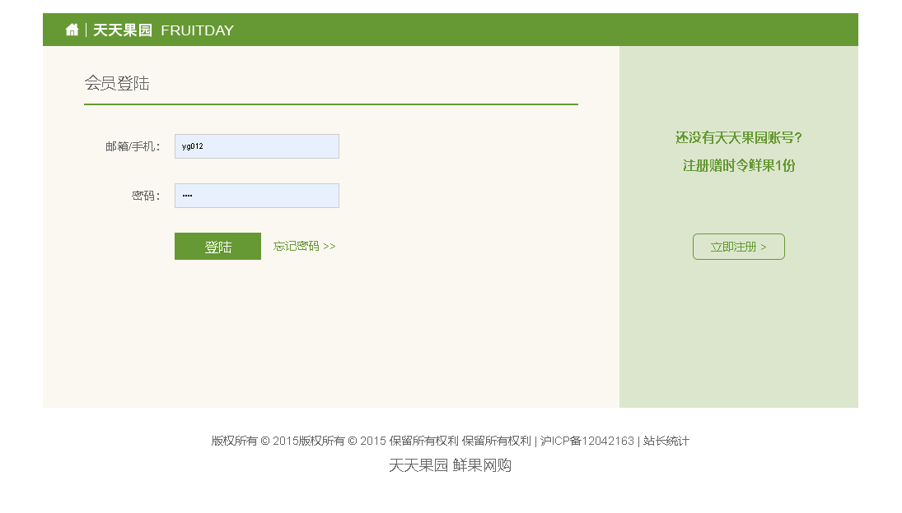
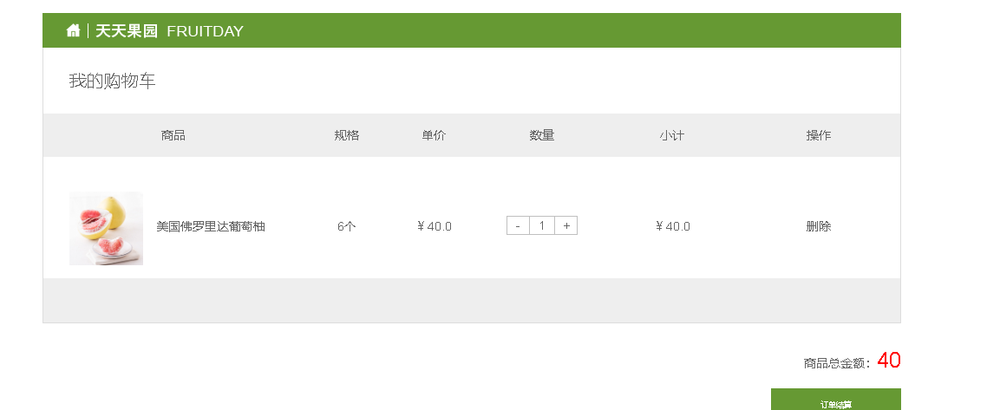
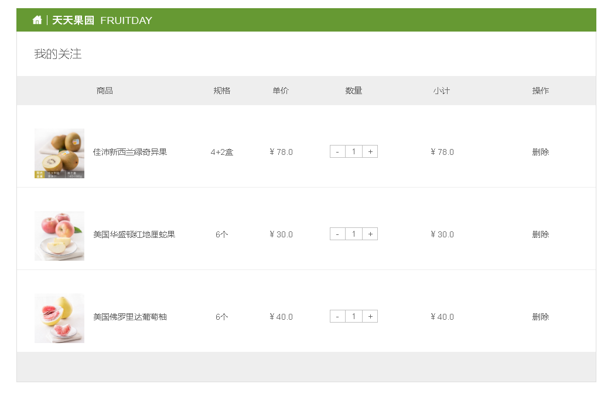
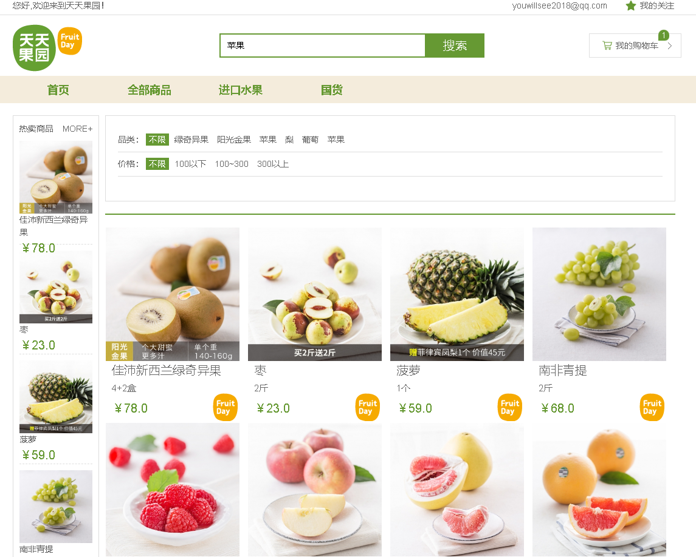
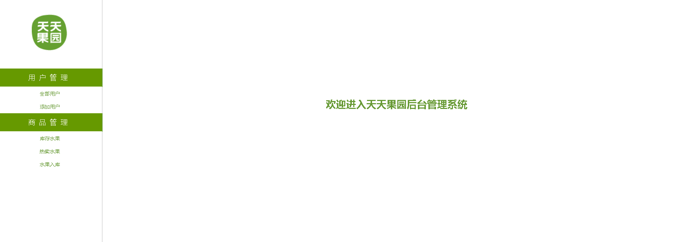
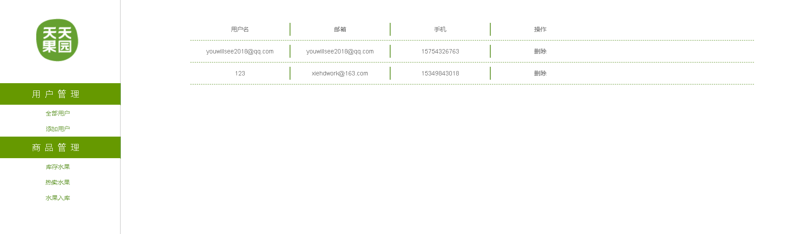
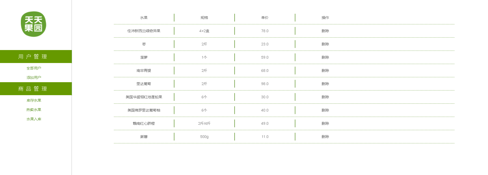

# ServletFruitsday

[Tomcat + Servlet + MySQL] FruitManage+fruitShoping
**水果销售平台+后台管理系统**

基于Servlet+MySQL 毕业设计：主题“水果销售平台+后台管理系统”；

项目完整代码已上传，包含必要代码备注

数据库私聊获取：

email：xiehdwork@163.com

wx:15349843018

项目部署+指导；论文指导；答辩细节指导......

#### 系统部分页面：

1. 系统首页：

2. 登录注册页

3. 购物车

4. 我的关注

5. 菜单页-01

6. 后台管理-首页

7. 用户管理

8. 商品管理

